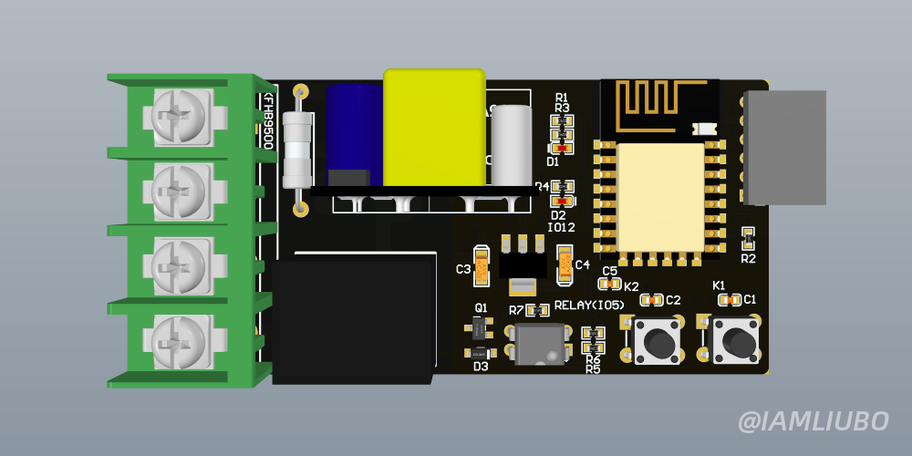

# 01 ESP8266 Relay Switch

## 硬件
请使用AD打开，可直接打样。

## 代码
代码是利用wukong-robot语音控制的，更多关于wukong-robot的介绍，可点击[链接](https://wukong.hahack.com/)了解更多。

## 演示
可以到我的B站主页查看相关视频。

[IAMLIUBO-bilibli](https://space.bilibili.com/31532108)

